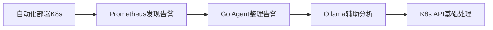
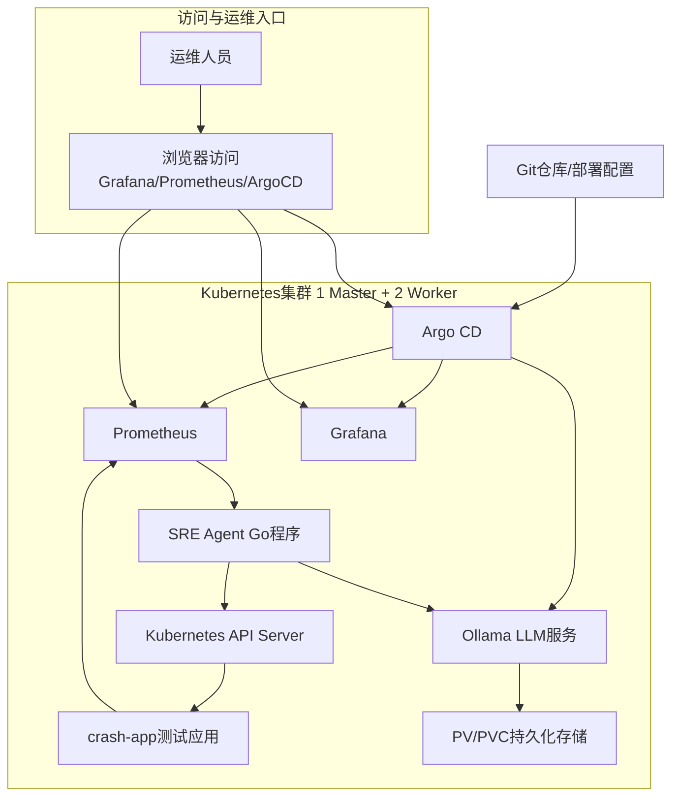
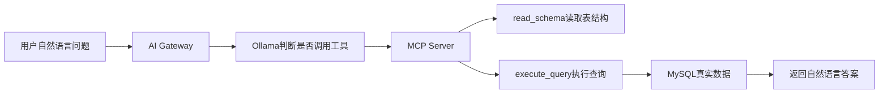
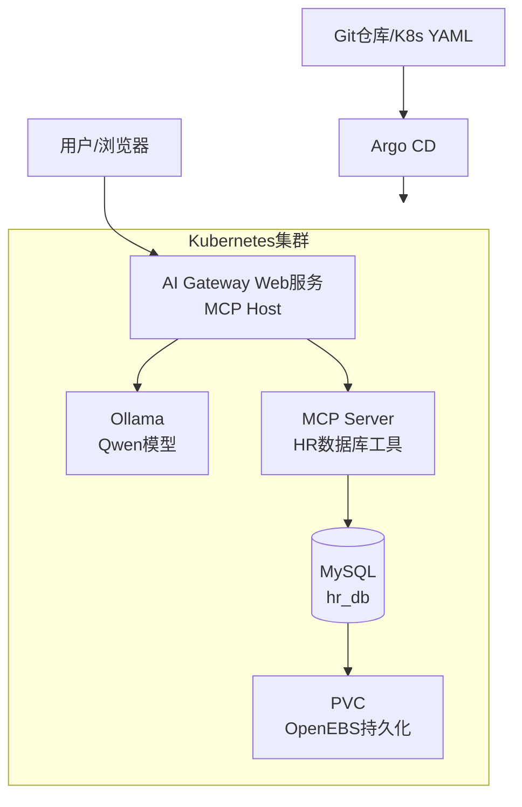

# 一、sre-agent-gitops
## 1. 项目背景

K8s 里组件多、状态多，Pod 异常时经常要看监控、查事件、查日志、看配置。对实习生来说，最容易卡在三个地方：

- 不知道先看哪个命令。
- 不知道告警对应什么故障。
- 手动部署和排查步骤多，容易漏。

所以这个项目把几块能力串起来：

## 2 项目整体规划

项目按五层来理解：

| 层次           | 做什么              | 对应组件                        | 面试表达                             |
| -------------- | ------------------- | ------------------------------- | ------------------------------------ |
| 环境准备层     | 先把 K8s 集群搭起来 | Ansible、Kubernetes             | 这是项目地基，不是核心业务逻辑       |
| 组件部署层     | 部署监控和 AI 组件  | Prometheus、Grafana、Ollama     | 让告警和模型能力可用                 |
| 故障模拟发现层 | 发现 Pod 异常       | 部署 Crash应用， PrometheusRule | 让系统主动发现 CrashLoopBackOff      |
| 智能分析层     | 整理告警并生成建议  | Go Agent、Ollama                | 把告警转换成可理解的处理建议         |
| 处理验证层     | 验证基础处理动作    | client-go、K8s API、Deployment  | 删除异常 Pod，让 Deployment 自动重建 |

## 3. 总体架构图

项目里我先部署了一个 crash-app，它启动后会直接退出，所以 Pod 会进入 CrashLoopBackOff。Prometheus 通过 kube-prometheus-stack 采集到这个状态，PrometheusRule 触发 PodCrashLooping 告警。Go Agent 每 30 秒请求 Prometheus 的 `/api/v1/alerts`，筛选 firing 状态的告警。如果告警名是 PodCrashLooping，就提取 Pod 名和命名空间，构造 Prompt 发给 Ollama。Ollama 返回建议后，Agent 判断里面是否包含 restart，如果包含，就通过 client-go 删除这个 Pod。因为 Pod 是 Deployment 管理的，删除后 Kubernetes 会自动重建。

# 二、MCP-agent
## 1. 项目背景

普通大模型本身不能直接访问企业内部数据库，也不知道数据库有哪些表和字段。如果让模型直接连数据库，会有几个问题：

- 不知道表结构，SQL 容易写错。
- 数据库账号直接暴露，安全风险比较高。
- 模型逻辑和数据库访问逻辑耦合在一起，后续不好维护。
- 查询过程不可控，不方便审计和限制权限。

所以这个项目把数据库查询能力封装成 MCP 工具，让 AI Gateway 通过 MCP Server 访问 MySQL。

## 2 项目整体规划

项目按五层来理解：

| 层次       | 做什么                     | 对应组件                                   | 面试表达                       |
| ---------- | -------------------------- | ------------------------------------------ | ------------------------------ |
| 数据准备层 | 准备 HR 示例数据           | MySQL、ConfigMap、PVC                      | 提供真实结构化数据源           |
| 工具封装层 | 把数据库能力封装成工具     | MCP Server、`read_schema`、`execute_query` | 让模型通过工具查数据           |
| 模型调度层 | 接收问题并决定是否调用工具 | AI Gateway、Ollama                         | Gateway 管调度，模型做判断     |
| 部署运行层 | 让服务跑在 K8s 里          | Kubernetes、Service、Docker、Argo CD       | 验证服务发现和部署链路         |
| 安全边界层 | 限制查询风险               | 只读账号、Secret、SQL 白名单、审计日志     | 当前是改进方向，面试要主动说明 |

## 3. 总体架构图

## 4. 组件说明

| 组件        | 作用                | 口语化解释                                 |
| ----------- | ------------------- | ------------------------------------------ |
| 用户浏览器  | 输入自然语言问题    | 比如“查询销售部员工”                       |
| AI Gateway  | Web 页面 + MCP Host | 接收用户问题，调用模型和工具               |
| Ollama      | 本地模型服务        | 让模型判断是否需要调用工具，并整理最终回答 |
| MCP Server  | 数据库工具服务      | 暴露 `read_schema` 和 `execute_query`      |
| MySQL       | HR 示例数据库       | 存 departments 和 employees 表             |
| OpenEBS/PVC | 数据持久化          | 防止 MySQL Pod 重启后数据丢失              |
| Docker 镜像 | 应用封装            | 封装 Gateway 和 MCP Server                 |
| Kubernetes  | 运行环境            | 部署 MySQL、Gateway、MCP Server、Ollama    |
| Argo CD     | GitOps 部署         | 从 Git 同步 K8s 配置到集群                 |

