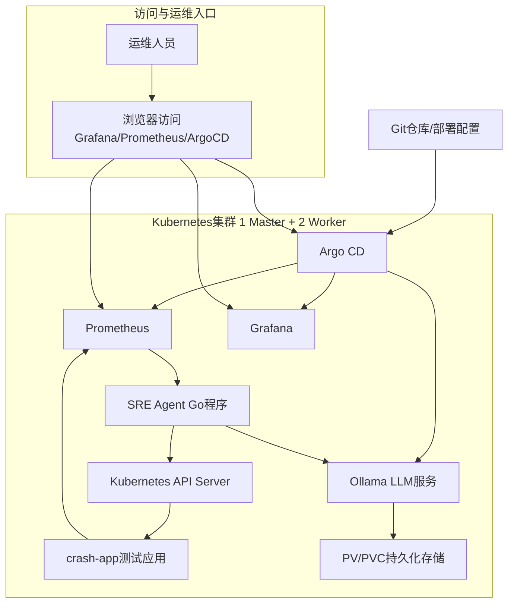
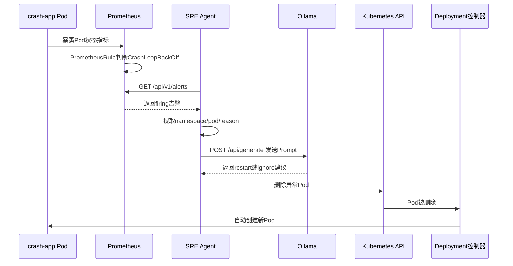

# sre-agent-gitops
## 1. 项目背景

K8s 里组件多、状态多，Pod 异常时经常要看监控、查事件、查日志、看配置。对实习生来说，最容易卡在三个地方：

- 不知道先看哪个命令。
- 不知道告警对应什么故障。
- 手动部署和排查步骤多，容易漏。

所以这个项目把几块能力串起来：

## 2 项目整体规划

项目按五层来理解：

| 层次           | 做什么              | 对应组件                        | 面试表达                             |
| -------------- | ------------------- | ------------------------------- | ------------------------------------ |
| 环境准备层     | 先把 K8s 集群搭起来 | Ansible、Kubernetes             | 这是项目地基，不是核心业务逻辑       |
| 组件部署层     | 部署监控和 AI 组件  | Prometheus、Grafana、Ollama     | 让告警和模型能力可用                 |
| 故障模拟发现层 | 发现 Pod 异常       | 部署 Crash应用， PrometheusRule | 让系统主动发现 CrashLoopBackOff      |
| 智能分析层     | 整理告警并生成建议  | Go Agent、Ollama                | 把告警转换成可理解的处理建议         |
| 处理验证层     | 验证基础处理动作    | client-go、K8s API、Deployment  | 删除异常 Pod，让 Deployment 自动重建 |

## 3. 总体架构图

## 4. 核心执行流程图

项目里我先部署了一个 crash-app，它启动后会直接退出，所以 Pod 会进入 CrashLoopBackOff。Prometheus 通过 kube-prometheus-stack 采集到这个状态，PrometheusRule 触发 PodCrashLooping 告警。Go Agent 每 30 秒请求 Prometheus 的 `/api/v1/alerts`，筛选 firing 状态的告警。如果告警名是 PodCrashLooping，就提取 Pod 名和命名空间，构造 Prompt 发给 Ollama。Ollama 返回建议后，Agent 判断里面是否包含 restart，如果包含，就通过 client-go 删除这个 Pod。因为 Pod 是 Deployment 管理的，删除后 Kubernetes 会自动重建。
